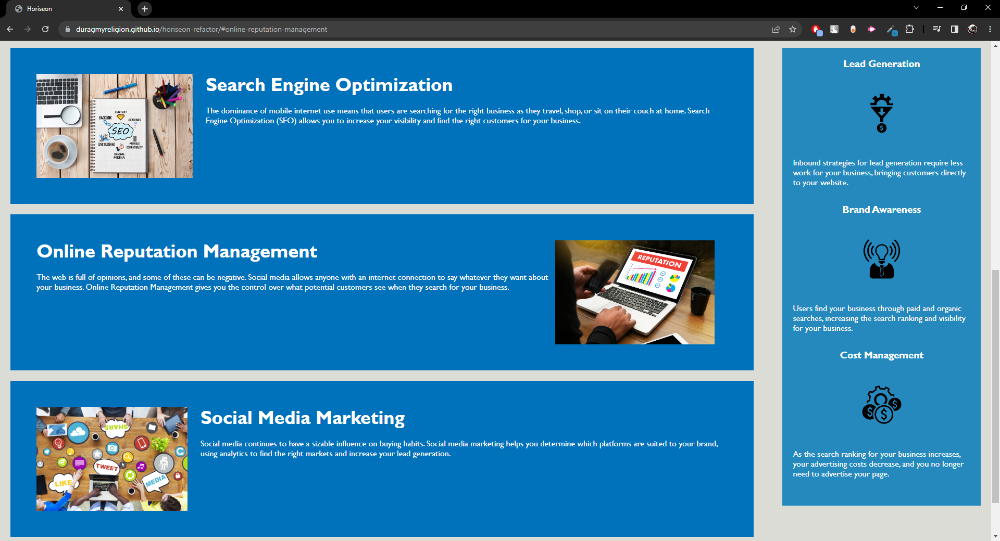
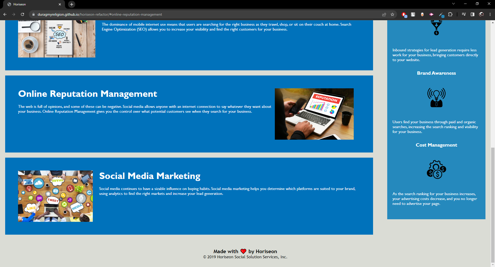

# horiseon-refactor

## Description

The reason behind making this project was to make sure the website met accessibility standards, to make sure the source code contained semantic HTML elements, to make sure the HTML elements all follow a logical structure of styling and positioning, making sure the heading attributes are in sequential order and that the title is concise and descriptive.

I made this project to make sure that it was completely accessibile to anybody who needs to use it. It has been optimised for search engines and now follows accessibility standards.

After editing the code within this project I have improved the codebase for long-term sustainability and honoured the 'Scout Rule', leaving the code cleaner than what it was before. The HTML and CSS documnets have been organised to follow semantic structures and elements/sections within the CSS document have been commented on to show what each feature does.

During this project I learnt how to comment properly on CSS documents, how to organise HTML code to follow semantic structures and how to simplify code to make it appear cleaner than what it was before.

## Usage

Although there isn't much to use within this project, I can still provide a description of how to use the website.

Link to deployed webpage: 
https://duragmyreligion.github.io/horiseon-refactor/#online-reputation-management

Features:

1. Left clicking on 'Search Engine Optimization' in the top navigation bar moves you to the 'Search Engine Optimization' section of the website and displays information about this topic.

2. Left clicking on 'Online Reputation Management' in the top navigation bar moves you to the 'Online Reputation Management' section of the website and displays information about this topic.

3. Left clicking on 'Social Media Marketing' in the top navigation bar moves you to the 'Social Media Marketing' section of the website and displays information about this topic.